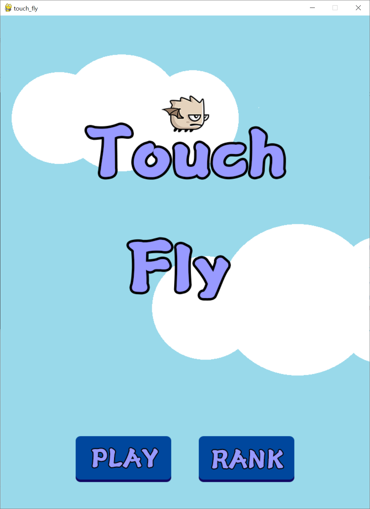
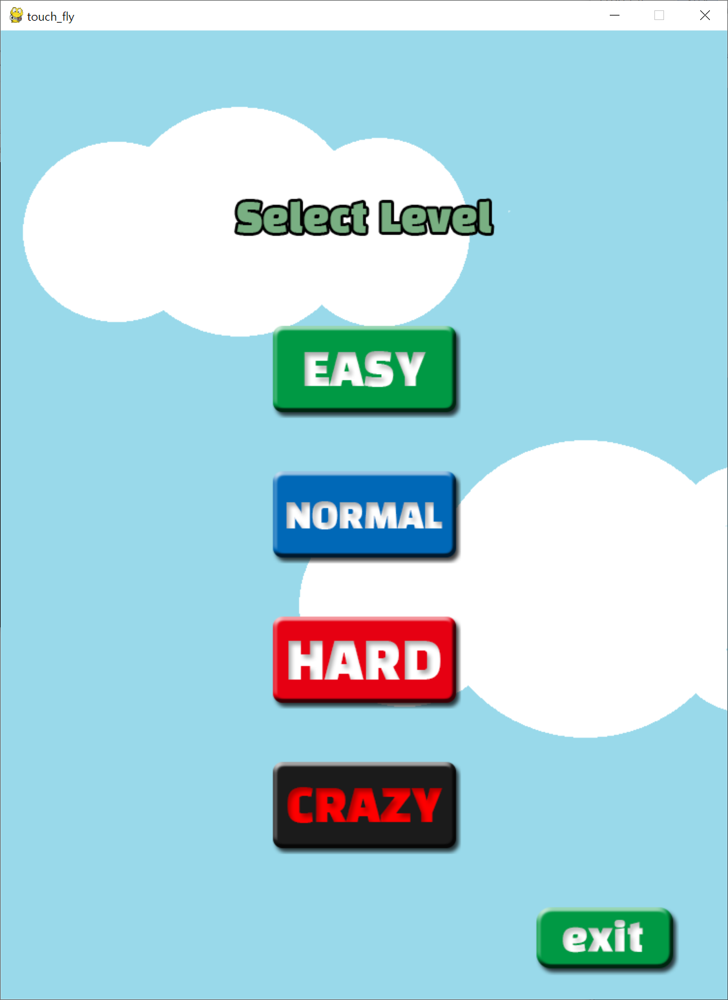
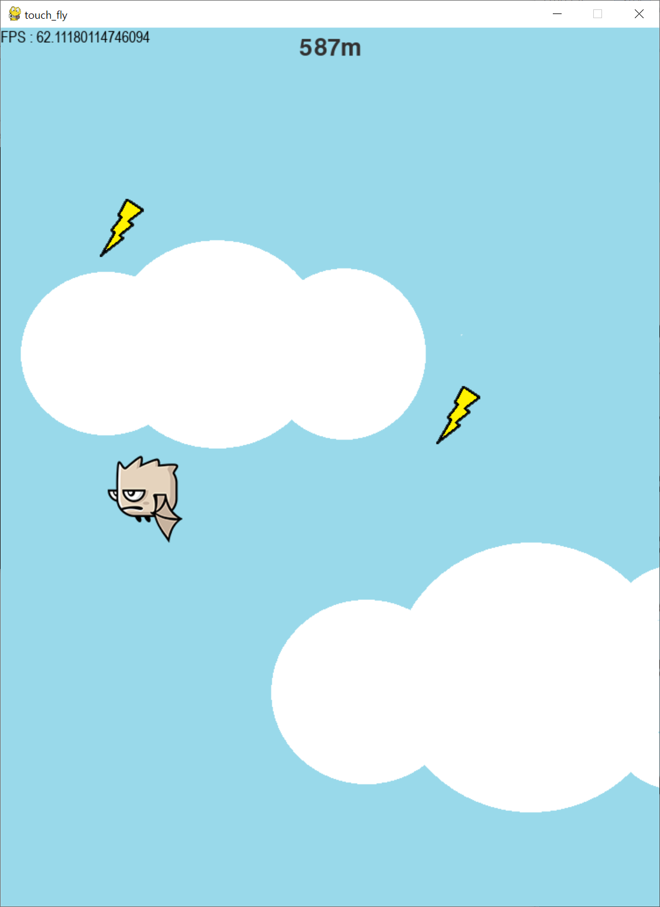
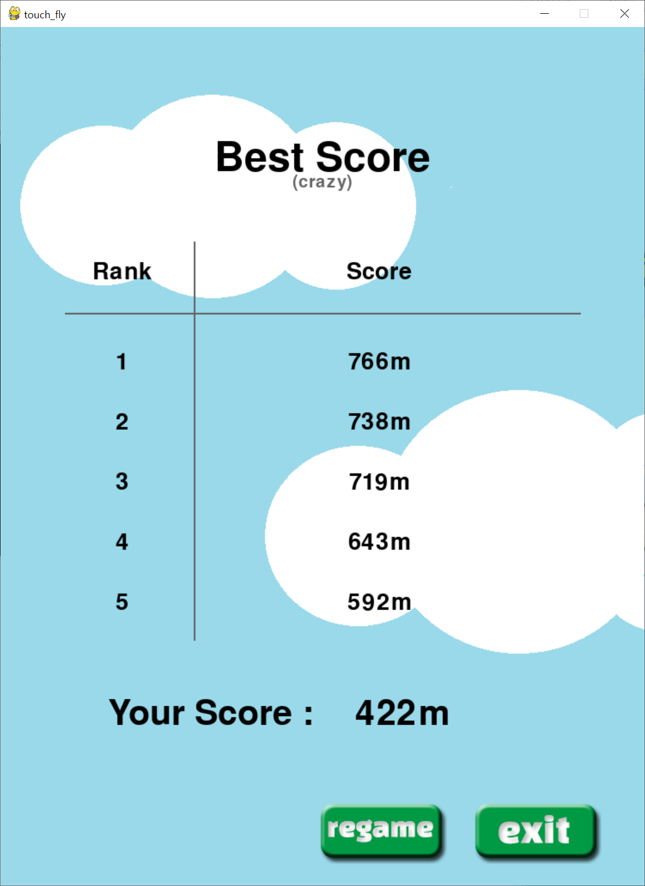

# touch-fly

### Go up as far as you can!!

## mplementation
```
pip install pygame
python main.py
```
```
← : left jump
→ : right jump
```

## Demo

|Scene|Picture|
|:---:|:---:|
|main menu| |
| level menu  | |
| in-game ||
|score |  |
